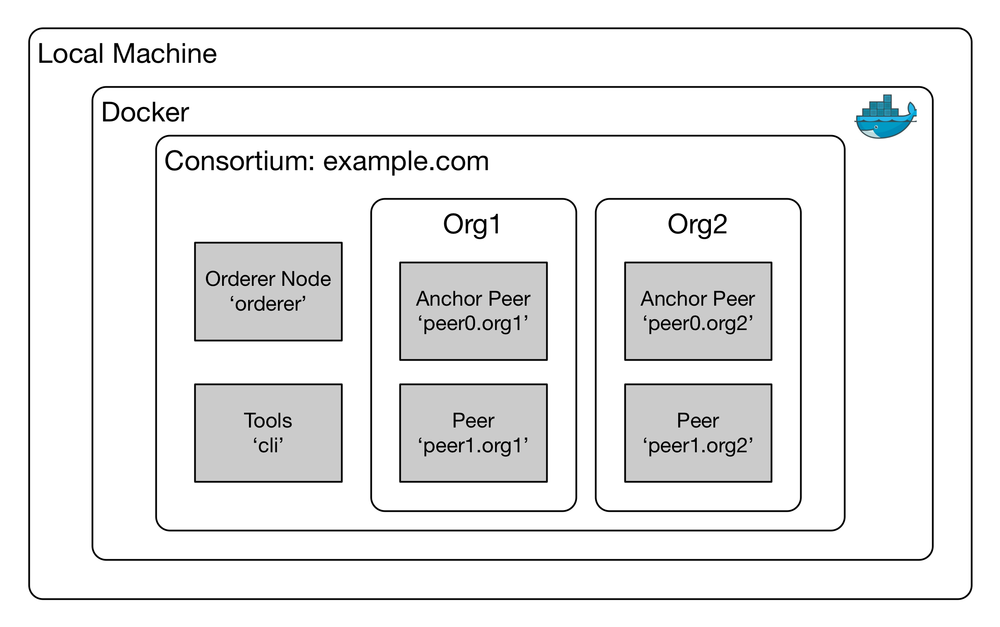

# Blockchain Lab 1 - Create a local Hyperledger Fabric

We’re going to create a simple Hyperledger Fabric v1.0 network on your machine, running in six Docker containers. It will have four peer nodes, an orderer node, and a tools node which we will use to interact with the others.



> **Learning Point:** in Hyperledger Fabric v1.0, Peer nodes are responsible for agreeing on the veracity of transactions (this is called _endorsing_). The Orderer node is then responsible for bundling the endorsed transactions into a block, encrypting it and adding it to the blockchain.

## Bluemix Account
The early parts of this lab are done on a local machine. To complete the later part of the lab you will need an IBM Bluemix account. Bluemix is a complete cloud development and production platform offering virtual servers, containers, Cloud Foundry and serverless compute options, as well as a wide range of storage, database, analytics and AI services. A _Lite_ account is free, has no time limit, and offers sufficient resources to run your own test Blockchain and associated apps, You can sign up at http://bluemix.net/.

## Getting started - download the binaries and Docker images
Start a Terminal window.  Create a new directory called _fabric-binaries_, switch into it, and run the command shown below to download the required binaries.  This command will also download the latest versions of the Hyperledger Fabric Docker images.
```bash
mkdir fabric-binaries
cd fabric-binaries
curl -sSL https://goo.gl/iX9dek | bash
```
> **NB:** GitHub has been having problems serving raw files via its CDN, which is how the command above works. If you get timeouts, do the next section (_Create the working directory_) first, then come back to this point and run the _bootstrap_ script file in the _blockchain_ directory.

> **Learning Point**: to create your Blockchain you will need to first create the keys and certificates which will keep it secure. The binaries you've just downloaded, _cryptogen_ and _configtxgen_, will do that.

You need to make sure that you can access these binaries from anywhere on your machine; to do that we need to update the _$PATH_ variable:
```bash
export PATH=$PWD/bin:$PATH
```
and test it to see if we can see the binaries - the _which_ command should return the full path of the executable file:
```bash
which cryptogen
```
> **Learning Point**: use `docker images` to see the images in your local Docker repository - Hyperledger Fabric uses these images (such as _fabric-peer_, _fabric-orderer_, _fabric-ca_ and _fabric-tools_) to build the Hyperledger network.

## Create the working directory
Come out of the _fabric-binaries_ directory and clone the Github repository to create a working directory - then switch into the _lab1_ sub-directory:
```bash
cd ..
git clone https://github.com/idpattison/blockchain-labs.git
cd blockchain-labs/lab1
```
> **NB:** this will download the files for all of the Blockchain labs.

> **Learning Point**: in the command line, two dots (..) means the parent directory, so `cd ..` means 'go up one level'.


## Create the keys and certificates
For peers to communicate with each other they need to be configured, initialised, and joined to a shared _channel_.
To do that you will need to use the binaries we just downloaded to generate some files, as follows:
- a set of keys and certificate files for each organisation and peer
- a 'genesis' block which will be used to initialise the network
- transaction files which will be used to initialise or 'anchor' each organisation
- a transaction file which will be used to configure the shared channel

> **Learning Point:** in Hyperledger Fabric v1.0, organisations can also be part of private channels, so that communication between a subset of the network participants can be private.

The _crypto-config.yaml_ file defines the organisational structure of our Hyperledger network.  Examine the file with your favourite coding editor – if you’re using Atom you can do this with
```bash
atom crypto-config.yaml
```
You can see that it defines an Orderer organisation and two Peer organisations.  `cryptogen` uses this organisation map to generate a set of keys and certificates in the _crypto-config_ directory.
```bash
cryptogen generate --config=./crypto-config.yaml
```

The _configtx.yaml_ file lays out the network topology which will be used by our Hyperledger network, showing the relationships between the Consortium, Organisations and Peers. Note that we have defined 2 organisations, each with 2 peer nodes. `configtxgen` uses that topology to create the configuration artefacts.

>**Learning Point:** take some time to browse the _crypto-config.yaml_ and _configtx.yaml_ files, especially the comments.  It will help you to understand the purpose of the various components of a Hyperledger network.

First define the location of the config files, then create the genesis block.
```bash
export FABRIC_CFG_PATH=$PWD
mkdir channel-artefacts
configtxgen -profile TwoOrgsOrdererGenesis -outputBlock ./channel-artefacts/genesis.block
```
You can see the file in the _channel-artefacts_ directory. Next create the channel configuration transaction.
```bash
configtxgen -profile TwoOrgsChannel -outputCreateChannelTx ./channel-artefacts/channel.tx -channelID mychannel
```
And finally the 2 peer anchor transactions.
```bash
configtxgen -profile TwoOrgsChannel -outputAnchorPeersUpdate ./channel-artefacts/Org1MSPanchors.tx -channelID mychannel -asOrg Org1MSP
configtxgen -profile TwoOrgsChannel -outputAnchorPeersUpdate ./channel-artefacts/Org2MSPanchors.tx -channelID mychannel -asOrg Org2MSP
```
We're now ready to start our Hyperledger network.

## Docker Compose file
Open the Docker Compose file – this is a series of instructions for Docker.  You can also specify these on the command line, but using a Docker Compose file saves some typing.  The file (_docker-compose.yaml_) is in the _lab1_ directory.

Let’s take a look at the file.  Docker will use this file to determine how many containers to start up, using which container images, and in what environment.

```bash
atom docker-compose.yaml
```


What you'll notice in here:
- We're creating a Docker network called _byfn_ (build your first network)
- we're creating 4 peer nodes - 2 peers in each of 2 orgs - this matches the network topology we defined earlier
- we're also creating an orderer node and a 'cli' node (command line interface)
- the orderer and the peers are defined in another file (_base/docker-compose-base.yaml_) - if you examine that file as well you will see that ultimately these containers are based on the _hyperledger/fabric-orderer_ and _hyperledger/fabric-peer_ images which you downloaded earlier
- the _cli_ node is more complex - it is based on the _hyperledger/fabric-tools_ image
- note the _volumes_ section in the _cli_ node configuration - it maps a number of local directories into the _cli_ node itself, so that we can make use of the key and certificate files we created earlier, and also a number of local scripts.


## Create the containers
Run the Docker Compose file to create the containers and set up our Hyperledger network. The first time you do this you will also need to set a project name:
```bash
export COMPOSE_PROJECT_NAME="hlf"
docker-compose -f docker-compose.yaml up -d
```

> **Learning Point**: the –d flag tells Docker to run in ‘detached’ mode, in other words, control will be returned back to the command line once the containers are up and running.  If you want to see the console logs from the containers as they run, omit the –d.  You will then need to open a new terminal window.

> **Note**: If you have ever used Hyperledger Fabric docker images before, you may see conflict notices when running docker-compose. To resolve remove or rename your existing images.

You can see your containers running with
```bash
docker ps

CONTAINER ID        IMAGE                        COMMAND             CREATED             STATUS              PORTS                                              NAMES
695aba81e94f        hyperledger/fabric-tools     "/bin/bash"         6 seconds ago       Up 4 seconds                                                           cli
89f15f015fed        hyperledger/fabric-peer      "peer node start"   8 seconds ago       Up 5 seconds        0.0.0.0:10051->7051/tcp, 0.0.0.0:10053->7053/tcp   peer1.org2.example.com
6ae0f21f4240        hyperledger/fabric-peer      "peer node start"   8 seconds ago       Up 5 seconds        0.0.0.0:8051->7051/tcp, 0.0.0.0:8053->7053/tcp     peer1.org1.example.com
da72a9ebf152        hyperledger/fabric-peer      "peer node start"   8 seconds ago       Up 6 seconds        0.0.0.0:9051->7051/tcp, 0.0.0.0:9053->7053/tcp     peer0.org2.example.com
1eb420ef48d2        hyperledger/fabric-orderer   "orderer"           8 seconds ago       Up 7 seconds        0.0.0.0:7050->7050/tcp                             orderer.example.com
a90e22a97239        hyperledger/fabric-peer      "peer node start"   8 seconds ago       Up 7 seconds        0.0.0.0:7051->7051/tcp, 0.0.0.0:7053->7053/tcp     peer0.org1.example.com

```
and you can inspect the environment of a running container with
```bash
docker inspect <container-id>
```
Note that you can abbreviate the container ID (_695aba81e94f_ in the output above) to just the first three characters (_695_), to make it easier to type.

If you want to see all of the current containers, whether they are running or stopped, use
```bash
docker ps -a
```


You have deployed Hyperledger Fabric to Docker containers on your local machine.  You can now continue straight on to [lab 2](./lab2-v1.md) where we will connect the peers to a channel and deploy some chaincode.
