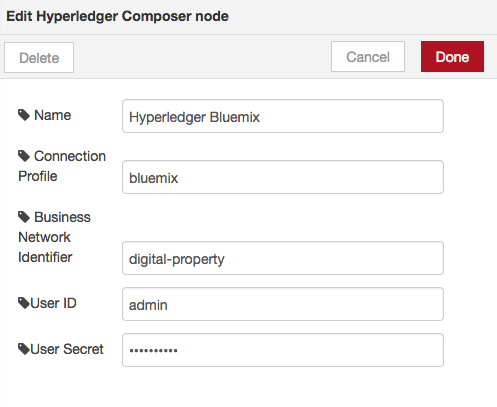
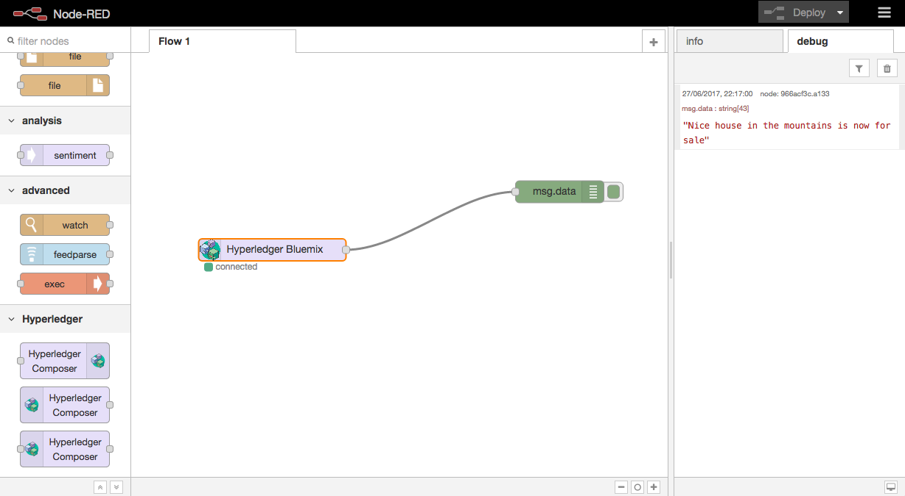
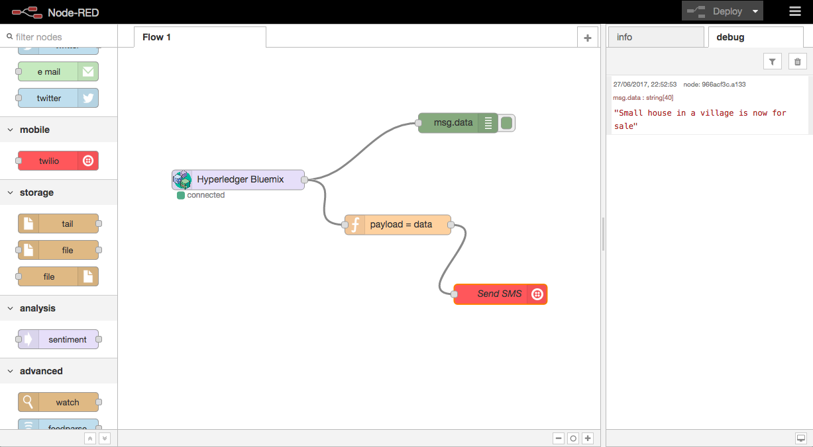
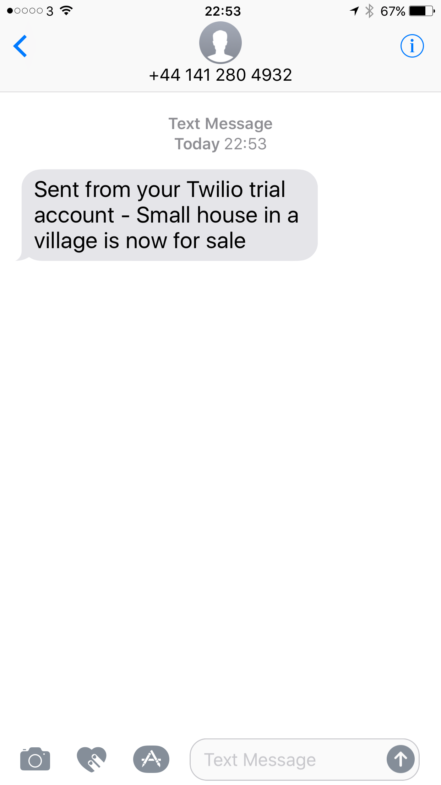

# Blockchain Lab 10 - Responding to events with Node-RED

Node-RED is a visual, low-coding environment for wiring together APIs, online services and hardware devices to create new and interesting solutions.

You can easily interact with your business model from Node-RED by using the HTTP nodes and making GET and POST calls.

However you can also use Node-RED to respond to events in your business model.  In this lab we will send an SMS message every time a property is marked as 'for sale'. We will use the Twilio service to do that.

## Install Node-RED and the additional nodes
If you haven't already, install Node-RED on your local machine. Then install the Hyperledger Composer and Twilio nodes.
```bash
$ sudo npm install -g --unsafe-perm node-red
$ sudo npm install -g node-red-contrib-hyperledger-composer
$ sudo npm install -g node-red-node-twilio
```
> **Learning Point:** using `sudo` allows us to install the Node-RED files globally, so they will be available to all of our projects.  You may have to enter your system password.

## Create an event in the business model
Assuming you're using the _digital-property_ model we created back in [lab 5](./lab5-v1.md), you can update this to create an event.

> **NB:** the easiest way to make simple changes to the model is to start Composer Playground, as we did in [lab 8](./lab8-v1.md), make the edits there and click _Deploy_. However, you can also make the edits in the source code as we did in [lab 5](./lab5-v1.md), create the _*.bna_ file using `composer archive create` and import that into Composer Playground.  Your choice.  In the instructions here, we're using the Playground to do the edits.

Open Composer Playground by browsing to http://your-ip-address:31080. You should see the business model which is currently deployed to your Blockchain. In the _Define_ tab, edit the _Model File_ to include the definition of our event at the bottom of the file:
```
event PropertyRegisteredForSale {
  o String data
}
```

Next, edit the _Script File_ and update the _onRegisterPropertyForSale_ function to look like this:
```javascript
function onRegisterPropertyForSale(propertyForSale) {
    console.log('### onRegisterPropertyForSale ' + propertyForSale.toString());
    propertyForSale.title.forSale = true;

    // create a new event
    var factory = getFactory();
    var event = factory.newEvent('net.biz.digitalPropertyNetwork', 'PropertyRegisteredForSale');

    // populate the event
    event.data = propertyForSale.title.information + ' is now for sale';

    // emit the event
    emit(event);

    return getAssetRegistry('net.biz.digitalPropertyNetwork.LandTitle').then(function(result) {
        return result.update(propertyForSale.title);
    }
    );
}
```

Now every time this transaction is executed, an event will be created with an explanatory message in _event.data_.

Hit _Deploy_ and the model will be redeployed to your Blockchain.  

Now restart the REST server by deleting the pod in which it is running. To do that, first find the name of the pod with
```bash
$ kubectl get pods
```
Find the _composer-rest-server_ one and delete it (you'll need to use the specific name of your pod)
```bash
$ kubectl delete pods composer-rest-server-1555901040-pgmfb
```

Kubernetes will automatically restart the REST server, and it will pick up the modified business network model.

> **NB:** you can also do this from the Kubernetes Dashboard that we saw in [lab7](./lab7-v1.md) - click on Pods, find the _composer-rest-server_ pod, click on the 3 vertical dots to the right, and click _Delete_.


## Start Node-RED and set up the flow
Start Node-RED from any Terminal window
```bash
$ node-red
```
Then browse to http://localhost:1880. You should see the Hyperledger Composer nodes towards the bottom of the left hand panel.

Drag a _hyperledger-composer-in_ node on to the canvas. Double-click to configure it, fill in the details (the ones you used to access your Blockchain locally) and click _Done_.



Click _Deploy_ to test the connection; after a few seconds the green _connected_ dot should appear.

Drag a _debug_ node on to the canvas, and configure it to show _msg.data_. Wire the two nodes together and deploy.

You can test it by executing a transaction in LoopBack explorer, or from your application by marking a property for sale. The message we created in the business network model will appear in the debug panel on the right.



## Send an SMS in response to the events
To do this you will need to set up an account at https://www.twilio.com.  Trial accounts get one phone number free, and you will need to make a note of your _Account SID_ and _Authorisation Token_.

In Node-RED, drag a _Twilio_ node on to the canvas.  Configure it with _local credentials_ and enter the details from your Twilio account, plus your own mobile phone number to receive the SMS.

You will also need a _function_ node - the Twilio node expects the message to be in `msg.payload`, whereas the Hyperledger event has it in `msg.data`. The function node should do the mapping (`msg.payload = msg.data`).



Wire the nodes together as shown, deploy, and execute another transaction.  If everything is working, you should get an SMS in a few seconds.



## Congratulations!

You've now learned how to detect and respond to events coming from your business network.  You can use Node-RED to trigger many different actions in response - send a tweet, start a business process, execute a transaction on another Blockchain, etc.

This is the end of the Blockchain labs. Thanks for following, and good luck with your Blockchain development!
