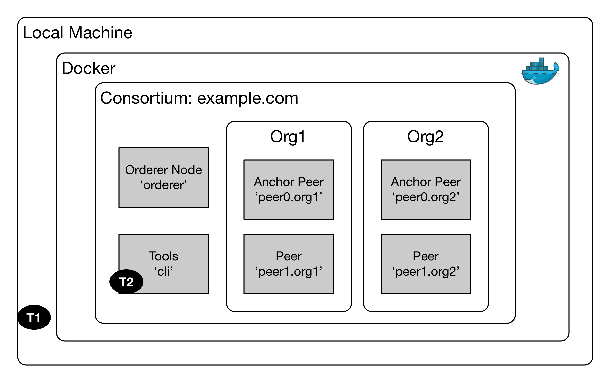

# Blockchain Lab 2 - Create channel, deploy and invoke chaincode

We will create a shared channel and connect all of the peers to it.
We will then download and install a simple chaincode into our Blockchain network.  The example chaincode allows us to do three things:
-	set up two participants, A and B, and provide each with an initial value
-	transfer an amount of value from one participant to the other
-	query the value for each participant

You can examine the chaincode here: https://github.com/hyperledger/fabric/blob/master/examples/chaincode/go/chaincode_example02/chaincode_example02.go


## Attach to the CLI peer
To create the channel and deploy the chaincode, we are going to attach to a running container, and execute some commands inside it (this is similar to ‘SSH’ing into a virtual machine).

Check the `docker ps` output and note the container names.  The one we want should be called _cli_ or something very similar. Note that the container name is different to the container ID, which is a random 12 character string.

Start a second Terminal window (it doesn’t matter which directory you’re in).  Now use the command `docker exec` to attach to the named container you identified above and execute the instruction _bash_ to start the command line inside the container.

```bash
docker exec -it cli bash
```

To be clear, you now have two Terminal windows.  The first (we’ll call it T1) has the command line for your local machine, and is set to your working directory.   The second (T2) has the command line for your _cli_ container.



## Create the shared channel and add peers
You create the channel and add peers to it from within the Blockchain itself. In Terminal T2, set the following environment variable, which is the location of the security certificate for the Orderer node:
```bash
ORDERER_CA=/opt/gopath/src/github.com/hyperledger/fabric/peer/crypto/ordererOrganizations/example.com/orderers/orderer.example.com/msp/tlscacerts/tlsca.example.com-cert.pem
```
> **NB:** this file actually lives on your local machine - remember that in the _docker-compose.yaml_ file we mapped a number of local directories into the _cli_ container.

Staying in Terminal T2 (and the whole of this section is in T2), create the shared channel (we'll call it _'mychannel'_) using the _channel.tx_ file we created in the previous lab.
```bash
peer channel create -o orderer.example.com:7050 -c mychannel -f ./channel-artefacts/channel.tx --tls true --cafile $ORDERER_CA
```
This creates a channel block (_mychannel.block_) in the local directory; use `ls` to see it. We will use that in the next step.

Now we need to add all 4 peer nodes to the channel.  You do that with the `peer channel join` command, but you need to set a number of global variables which are specific to each channel before doing that. To simplify things, we've created a script (_set-globals.sh_) which does that for you. Run it with the appropriate peer number:
- 10: org1, peer0
- 11: org1, peer1
- 20: org2, peer0
- 21: org2, peer1

Then, any `peer` command you issue will affect that peer, until you change it again.

So to join all 4 peers to the channel, run:
```bash
source scripts/set-globals.sh 10
peer channel join -b mychannel.block
source scripts/set-globals.sh 11
peer channel join -b mychannel.block
source scripts/set-globals.sh 20
peer channel join -b mychannel.block
source scripts/set-globals.sh 21
peer channel join -b mychannel.block
```

An _anchor peer_ is a peer (typically one per organisation) which all other peers can discover and communicate with. To define the anchor peers, update them as follows (note that you only need to do this with the 2 _peer0_ nodes):
```bash
source scripts/set-globals.sh 10
peer channel update -o orderer.example.com:7050 -c mychannel -f ./channel-artefacts/Org1MSPanchors.tx --tls true --cafile $ORDERER_CA
source scripts/set-globals.sh 20
peer channel update -o orderer.example.com:7050 -c mychannel -f ./channel-artefacts/Org2MSPanchors.tx --tls true --cafile $ORDERER_CA
```

## Deploy the chaincode
Next we need to install the chaincode on the peers. We will call this chaincode _'mycc'_, and initially we will only install it on the anchor peers.  We're still in Terminal T2.
```bash
source scripts/set-globals.sh 10
peer chaincode install -n mycc -v 1.0 -p github.com/hyperledger/fabric/examples/chaincode/go/chaincode_example02
source scripts/set-globals.sh 20
peer chaincode install -n mycc -v 1.0 -p github.com/hyperledger/fabric/examples/chaincode/go/chaincode_example02
```

We will now initialise the chaincode with its starter values. Note that we are passing 4 arguments to the init() function.  The result of this is to set the value of ‘a’ to 100 and ‘b’ to 200.  You can check this by looking at the chaincode, as above.  
```bash
source scripts/set-globals.sh 20
peer chaincode instantiate -o orderer.example.com:7050 --tls true --cafile $ORDERER_CA -C mychannel -n mycc -v 1.0 -c '{"Args":["init","a","100","b","200"]}' -P "OR    ('Org1MSP.member','Org2MSP.member')"
```

This may take a few seconds. If you now check the output of `docker ps` (you'll need to do that from Terminal T1), you will see that a new container (_dev-peer0.org2.example.com-mycc-1.0_) has been created - this contains our chaincode.

## Query the chaincode
Note that we only need to instantiate the chaincode on one peer (in this case org2, peer0) - the transaction will flow across to the other peers which have the chaincode installed.

To prove this, let's query the chaincode for the value of 'a' on org1, peer0.
```bash
source scripts/set-globals.sh 10
peer chaincode query -C mychannel -n mycc -c '{"Args":["query","a"]}'
```
The value of ‘a’ should be 100, which is the value we initialised it to.

You can also check that as we use the chaincode on each peer node, another container is created for that node.

## Invoke a transaction
Now we’re going to invoke a transaction to transfer 10 from ‘a’ to ‘b’, then we're going to query the value of 'a':
```bash
source scripts/set-globals.sh 10
peer chaincode invoke -o orderer.example.com:7050  --tls true --cafile $ORDERER_CA -C mychannel -n mycc -c '{"Args":["invoke","a","b","10"]}'
peer chaincode query -C mychannel -n mycc -c '{"Args":["query","a"]}'
```
You should see that the value of ‘a’ is now 90.

For some added fun, we will now install the chaincode on another peer (org2, peer1) and query it there.  When we do this, it will apply the transactions which have already happened, in order to keep the network in sync.
```bash
source scripts/set-globals.sh 21
peer chaincode install -n mycc -v 1.0 -p github.com/hyperledger/fabric/examples/chaincode/go/chaincode_example02
peer chaincode query -C mychannel -n mycc -c '{"Args":["query","a"]}'
```
You should get the correct value of 'a', which is 90.

Type exit to leave the _cli_ container’s command line.  You can now close this window.

## Cleaning up
Congratulations! You’ve just created a channel, and deployed and invoked chaincode on a Hyperledger Blockchain network.

The easiest way to clean up your containers is like this:
```bash
docker-compose down
```
which does the opposite of `docker-compose up`.  This will remove everything which you created.

However it is useful to know the other Docker commands for cleaning up:
-	`docker kill` – sends SIGTERM to the running process in a container, stopping it
-	`docker stop` – stops the container itself
-	`docker rm` – removes the container completely

> **Learning Point**: don't get confused with containers and images. An image is a template for creating a container. A container is an actual process which can run (although it may be stopped). You can create multiple containers from the same image.

You can pass the individual container IDs to these commands (or the first 3 characters, which will also work), for example
```bash
docker stop 2a5 3d1
```
Or you can use the following compound instructions, which will stop and remove all containers
```bash
docker stop $(docker ps -qa)
docker rm $(docker ps -qa)
```

> **NB:** the compound format above using the symbol runs the first command (the one in brackets), then passes the output of that to the second command. Run `docker ps -qa` to see the intermediate stage.

Hyperledger also creates a new container image for the chaincode you deployed, and although you have removed that container you should also remove the image it was created from, as it may cause problems with future labs.  Get the image ID from `docker images`, then
```bash
docker rmi <image-id>
```

If the container still exists you'll need to force the deletion of the image with `docker rmi -f <image-id>`.

## The Easy Way
If you just want to quickly create a Hyperledger v1.0 network and deploy chaincode to it, you can use the script file. These 3 options generate the keys and certificates, bring the whole network up, and take it down again.
```bash
./byfn.sh -m generate
./byfn.sh -m up
./byfn.sh -m down
```
Of course, you don't learn much doing it this way.

Continue with [lab 3](./lab3-v1.md).
