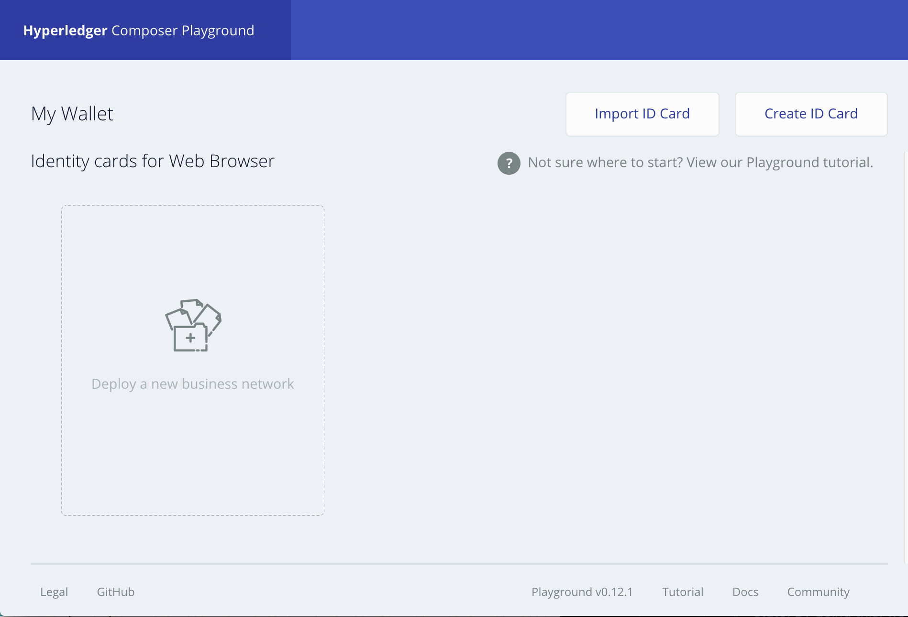
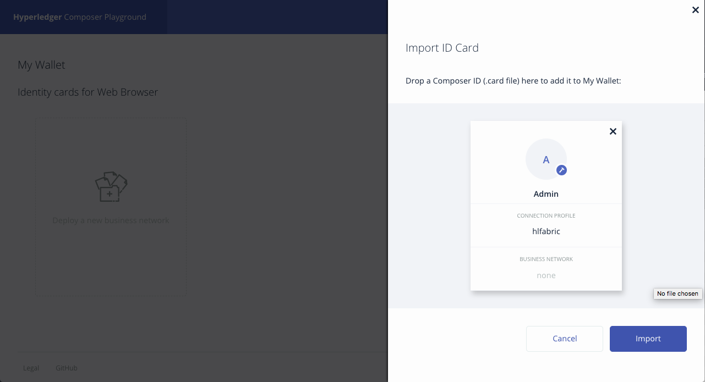

# Blockchain Lab 3 - Hyperledger Composer Playground

The previous lab showed that deploying and invoking chaincode directly on a Blockchain is a complex process which involves working directly with the Hyperledger peers using `docker exec`.  This lab looks at Hyperledger Composer, which abstracts away the detailed implementation and allows you to focus on a business model and network.

First, we’re going to set up a simple Hyperledger v1.0 network consisting of 4 containers (a peer, an orderer, a certificate authority and a database), plus an additional container running Hyperledger Composer.  This will be accessed from a browser, and will be used to define and deploy a business network to the Hyperledger Blockchain.

In the next lab we will set up a REST API server and a UI app, both running on our local machine, and show how we can use those to access the business network model that we will deploy here.


## Pull the Hyperledger Composer image
You should already have the Hyperledger Fabric Docker images from the previous lab (if not you can run the `./downloadFabric.sh` script in the _lab3_ directory). We now need to get the Hyperledger Composer image from Docker Hub, and tag it as _latest_.
```bash
docker pull hyperledger/composer-playground:0.14.2
docker tag hyperledger/composer-playground:0.14.2 hyperledger/composer-playground:latest
```

## Set up Hyperledger Composer
Switch to the _lab3_ directory.  In there you’ll find another _docker-compose.yml_ file.

Open that file – again, if you’re using Atom you can do this with
```bash
atom docker-compose.yml
```
You’ll notice that this is somewhat different to the file we used in lab 1. This file will create five containers:
- a single peer (_peer0.org1.example.com_) which we will use to interact with the Blockchain - we've already shown how transaction replication works, so we can now simplify down to a single peer for this lab
- an orderer (_orderer.example.com_) which, as in the previous lab, will arrange transactions into blocks and add them to the chain
- a certificate authority (_ca.org1.example.com_) which will manage the participants in the network and their permissions
- a database (_couchdb_) which will maintain the current state of the assets in the Blockchain (known as the 'world state')
- an instance of Hyperledger Composer (_composer_) which we will use to create and deploy business models

> **Learning Point:** Hyperledger Fabric holds a record of transactions. To speed things up, it also holds the current state of the assets (which is the sum of all the transactions - the world state) in the peers. You can configure Hyperledger to use CouchDB (the database which underpins Cloudant) instead, and that's what we've done here - the docker-compose file shows how the peer looks to CouchDB for its state. By doing this, we can make complex queries on the current state of the assets in the Blockchain.


When we run `docker-compose up`, this will create our Hyperledger Fabric network along with a copy of Hyperledger Composer.  Some things to note:
-	We’ve exposed port 8080, so we can run Composer via a web interface
- It also specifies a channel, so we need to set that up, as we did in lab 2

You may also notice that the password for the _PeerAdmin_ user is not very secure.  For the development environment, _PeerAdmin_ is set up to accept any password.  Obviously you would remove this user for production.

> **Learning Point:** connection profiles are stored in the _~/.composer-connection-profiles/_ directory on your local machine.  However, as we're running Composer in a container, it will be stored in that directory _**on the container**_. This can cause confusion, so always bear in mind where you are connecting to Hyperledger from - local machine or container.

Create a private network, then start all five containers with
```bash
docker network create composer_default
docker-compose up -d
```
If you run `docker ps` you will see that we do now have five containers running.

> **NB:** the generation of the genesis block and the channel artefacts has already been done - you can see these files in the _lab3_ directory, and they are used by the Docker containers when they start up.

## Create the channel
In lab 2 you used `docker exec` to connect to and work directly with the peers, create the channel, join it, and deploy chaincode. In this lab we will cheat a little by passing the commands to the peers remotely using `docker exec`.  If you look closely you'll see that it's the same `peer channel create` and `peer channel join` that we used previously, but it's a bit simpler as there is only one peer (and you don't need to run a separate Terminal window).

To create a channel and connect our peer to it:
```bash
docker exec peer0.org1.example.com peer channel create -o orderer.example.com:7050 -c composerchannel -f /etc/hyperledger/configtx/composer-channel.tx
docker exec -e "CORE_PEER_MSPCONFIGPATH=/etc/hyperledger/msp/users/Admin@org1.example.com/msp" peer0.org1.example.com peer channel join -b composerchannel.block
```

## Start the Hyperledger Composer Playground
Open a web browser and navigate to http://localhost:8080 and click through the splash screen. Once done, you should see the main Hyperledger Composer Playground window:



## Import the ID Card
An ID card provides all of the information needed to connect to a blockchain business network. It is only possible to access a blockchain Business Network through a valid ID Card. An ID Card contains and Identity for a single Participant within a deployed business network. ID Cards are used in the Hyperledger Composer Playground to connect to deployed Business Networks. You can have multiple ID Cards for a single deployed Business Network, where those ID Cards belong to multiple Participants.

To simplify things we have provided a ready-made ID card for our network located at `lab3/creds/Admin.card`. The Admin.card file is simply a zip file containing all of the required connection details and credentials. For your reference, you can view the full contents of the uncompressed file in the `lab3/creds/Admin` folder.

Click _Import ID card_ and choose the ready-made card, `Admin.card`, to import the contents into your wallet.



## Deploy a business network
Composer provides several sample business networks, for example the  _basic-sample-network_ – this is the ‘Hello World’ of business models.  

However, we are going to start with slightly more interesting sample.  Click on _Deploy a new business network_ next to your new ID card.
> **NB:** make sure you click the button in the lower part of the screen.  There is another _deploy a new business network_ button in the top part; this will deploy to the web browser only.

Then give the new network the name _digitalproperty-network_ and select the _digitalproperty-network_ sample from the list.  Use the ID and secret _Admin_ and _anything_, and click _Deploy_.
> **NB:** for the development environment, the Admin password needs to be present, but is not checked.


Wait until the business network is deployed to our Blockchain.  You can check that this has happened with `docker ps` - you should see a new container called something like _dev-peer0.org1.example.com-digitalproperty-network-0.14.2_.  If you're quick you will see that the _fabric-ccenv_ container also starts briefly, then terminates.  _fabric-ccenv_'s job is to create the containers for our chaincode.

This business network allows us to record details about people, properties (land titles) and property sales agreements, and allows us to invoke one transaction – _RegisterPropertyForSale_.   

Click _Connect now_ from the wallet to examine the Model and Script files and familiarize yourself with the details of our business network.


## Entering data into the business network
In Composer Playground, click on the _Test_ tab – this will allow us to enter data and test transactions.  In the left sidebar you will see the types of participants and assets we defined in our model.

Select _Person_, and click on _Create New Participant_ in the top right.


This allows us to enter an entity of class _Person_.  Add a _firstName_ and _lastName_, and note down the digits of the _personId_, as you will need that later.  Click _Create New_.
> **NB:** there's a convention that the _personId_ is of format _personId:xxxx_, but it could be any unique String.

Add several more people.  Each time you do, a new block is being added to the Blockchain.


Next click _LandTitle_ in the left sidebar, and repeat the process to add some properties.  This time, because there is a foreign key relationship between Person and Land Title (a Person is the _owner_ of a LandTitle), you will need to specify a _personId_ that you noted down earlier as the owner (note that you only need to change the digits).  Also, note down the digits of the _titleId_ of this property.

Add a few more properties if you want.

## Executing a transaction
We will now execute a transaction to register a property for sale.  If you haven’t already, note down the _titleId_ and _owner_ of one of your properties.  Click on _Submit Transaction_.  Enter the _titleId_ digits in _title_ field, and the _owner_ digits in the _seller_ field.  Click _Submit_.

This will execute the transaction in the Blockchain (you will get another block added).  If you now check the list of properties, you will see that one is now for sale.

## Change the business network and redeploy
Click on the _Define_ tab to go back to the model definition.  In the Script file, add the line beginning _propertyForSale.title.information_:
```javascript
function onRegisterPropertyForSale(propertyForSale) {
    console.log('### onRegisterPropertyForSale ' + propertyForSale.toString());
    propertyForSale.title.forSale = true;
    propertyForSale.title.information += " – NOW FOR SALE!!";

    return getAssetRegistry('net.biz.digitalPropertyNetwork.LandTitle').then(function(result) {
        return result.update(propertyForSale.title);
    }
    );
}
```

This will modify the transaction to add a comment to the end of the property’s _information_ field.  Check the model file to see if you can follow the logical flow of what we’ve done here.

Click _Update_ to redeploy the business network to the Blockchain.

Go back to the _Test_ tab and submit another _RegisterPropertyForSale_ transaction on a different property.  When it has completed, check that the property now has the "FOR SALE!!” comment in its _information_ field.

Continue with [lab 4](./lab4-v1.md).

## The Easy Way
To set this up quickly, you can download all of the required files to an empty directory, create the containers, and start Hyperledger Composer with just one instruction:
```bash
curl -sSL https://hyperledger.github.io/composer/install-hlfv1.sh | bash
```

See https://hyperledger.github.io/composer/installing/using-playground-locally.html for more details.
