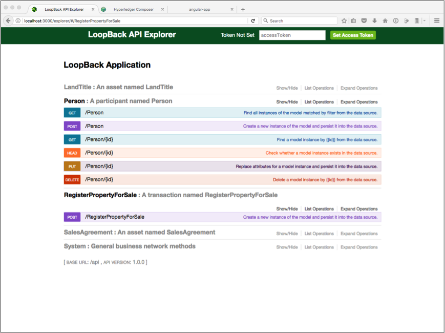
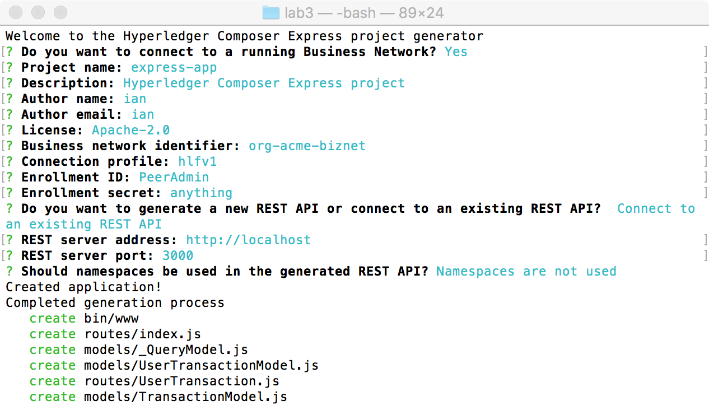
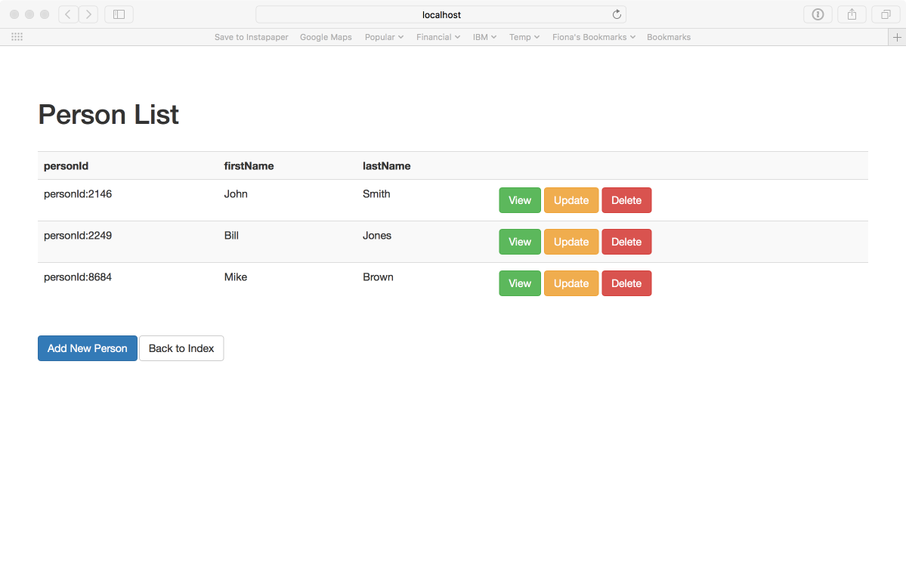

# Blockchain Lab 4 - Hyperledger Composer REST API

This lab builds on the last and shows how to deploy Composer's REST API Server to expose the contents of your Blockchain.

First, we’re going to start the REST API server, running on our local machine, and show how we can use that to access the business network model we deployed in the previous lab.

Second, we’re going to generate a simple web application, which will use Node.js and the Express framework.  This application will call the REST server we just set up to access the business network.


> **Learning Point:** REST stands for REpresentational State Transfer and is a standard way of building an Application Programming Interface (API).  If you want to know more, see [here](http://www.restapitutorial.com/lessons/whatisrest.html).

## Installing Hyperledger Composer
Install Hyperledger Composer's Command Line Interface (CLI) and REST Server
```bash
$ npm install -g composer-cli@0.11.1
$ npm install -g composer-rest-server@0.11.1
```
> **NB:** if you're comfortable with _npm_ you'll recognise this as a global installation, and you might be tempted to run it with `sudo` - don't do that here, it will cause errors. It should install successfully with your normal user account.

## Setting up the REST API server
Hyperledger Composer is great for trying out business networks with models and transactions, but you need to expose your network to the outside world to make it useful.   To do that, we will start a REST API server, based on LoopBack.
> **Learning Point:** LoopBack is an open source framework for creating APIs based on an underlying data model.

First we need a connection profile to enable the REST server to connect to our Blockchain.  We previously pushed that into a container via the _docker-compose.yml_ file, but here we will be running the REST server directly on the local machine, so we need to set up the connection profile on the local machine.  Connection profiles live in a specific directory, _~/.composer-connection-profiles_, which we need to create. The tilde(~) is shorthand for 'home directory'.

In these commands, you need to replace `<HOME>` with your home directory
-	for Mac this is _/Users/user-name_, e.g. _/Users/ian_
-	for Ubuntu this is _/home/user-name_, e.g. _/home/fred_
```bash
$ mkdir -p /<HOME>/.composer-connection-profiles/hlfv1
$ atom /<HOME>/.composer-connection-profiles/hlfv1/connection.json
```

Copy the following connection profile into the new file.  You need to modify the _keyValStore_ parameter with your `<HOME>` directory as above.  Then save the file.

> **NB:** if you get problems with copying, there is a _connection.json_ file in the _lab3_ directory, you can simply copy this across instead, but you still need to change the `<HOME>` directory.

```json
{
    "type": "hlfv1",
    "orderers": [
       { "url" : "grpc://localhost:7050" }
    ],
    "ca": { "url": "http://localhost:7054",
            "name": "ca.org1.example.com"
    },
    "peers": [
        {
            "requestURL": "grpc://localhost:7051",
            "eventURL": "grpc://localhost:7053"
        }
    ],
    "keyValStore": "/<HOME>/.composer-credentials",
    "channel": "composerchannel",
    "mspID": "Org1MSP",
    "timeout": "300"
}
```

Next you need to set up the credentials to access the Blockchain network. They also live in a specific directory, _~/.composer-credentials_.  For the development environment they have been pre-generated, and are in the _creds_ directory within our _lab3_ directory, from where we need to copy them over.

Navigate to the _lab3_ directory, then run:
```bash
$ mkdir /<HOME>/.composer-credentials
$ cp creds/* /<HOME>/.composer-credentials
```

Now run the REST server, passing in the following parameters:
- the connection profile name (hlfv1)
- the business network name (org-acme-biznet)
- the ID (PeerAdmin) and password (recall that for _PeerAdmin_ this can be anything)
- that you don't want to use namespaces, secure APIs, WebSockets or TLS

You can run the command on its own and enter the options manually:
```bash
$ composer-rest-server
```
or you can do it all on the command line:
```bash
$ composer-rest-server -p hlfv1 -n org-acme-biznet -i PeerAdmin -s whatever -N never
```

> **Learning Point:** the name of the container which holds the chaincode is _dev-(peer-name)-(business-network-name)-(version)_, so something like _dev-peer0.org1.example.com-org-acme-biznet-0.11.1_. This is how Composer maps from the business network name you specify, to an actual piece of running chaincode. If you get errors when connecting to your business network, check the `docker ps` output to make sure you've got the right name.

> **NB:** there is an issue with Composer Playground which means that the chaincode container is not renamed when a new business model is deployed. Hence we're using _org-acme-biznet_ here, even though we replaced that model with _digitalbusiness-network_. This will be fixed in a later version.

Let the REST server start up (might take a minute).  You can now browse the API specification for your business model at http://localhost:3000/explorer. Click on _Show/Hide_ to expand each section.



Click on _GET /Person_ and _Try it out!_.  You should see the Person objects you created earlier.  You can also create new objects and execute transactions using the LoopBack Explorer.

## Creating complex queries
You'll notice that we're currently restricted to retrieving _all_ of the objects of a particular type. Because we're using CouchDB as the database for the world state, we can create and run queries using SQL. These queries are stored in the model and are also called using APIs.

In Hyperledger Composer Playground (remember we accessed that with http://localhost:8080) click _Add a file_ in the left hand sidebar and add a new Query file - it will be called _queries.qry_. Add this text:

```sql
query Q1 {
  description: "select Person by last name"
  statement:
    SELECT net.biz.digitalPropertyNetwork.Person
      WHERE (lastName == _$nameParam)
}
```
Click _Deploy_ to update the business network model.

Stop and restart the REST server - kill the process in the Terminal window with _Ctrl+C_ the run the `composer-rest-server` command again. Then browse to the REST server with http://localhost:3000/explorer. You should now see a _Query_ section. Add some Person objects with different last names, and try the query.

## Generating a starter application
You can use Yeoman to generate a basic application.  Yeoman is a code generator tool which can be used to ‘scaffold out’ an application for later development.  

> **NB:** Hyperledger Composer has its own generator which builds Angular code. In this lab we will be using a different generator which builds Node.js Express code, which is easier to modify when building quick prototypes. You can find out about the Angular generator [here](https://hyperledger.github.io/composer/tutorials/developer-guide.html).


Install Yeoman and the Express generator
```bash
$ npm install -g yo
$ npm install -g generator-idp-composer-express
```

> **NB:** the generator is not part of the 'official' Hyperledger Composer package, and is provided as-is to help you quickly build a prototype for demonstration purposes.  **Do not** use it for production code.

Run the Yeoman generator with
```bash
$ yo idp-composer-express:express
```



Enter the responses as shown above, a brief discussion follows:
-	we are creating a Node.js Express application.  This framework is used by many production apps, e.g. eBay, LinkedIn, Uber and Walmart.
-	we will connect the app to our existing business network running on Blockchain, and we need to provide the connection profile name, the business network name and our security credentials to do that.
-	The name of the app doesn’t matter (here we used the default _express-app_), although this will be used for the directory which holds the generated files.
-	The description, author name and email are required, but the values are not important.
-	Yeoman can generate a REST server for us, but as we have one running already, we will use that – enter the address (http://localhost) and port (3000).
-	If you asked for no namespaces in your REST server, then make sure you tell Yeoman they are not used.

Yeoman will create a set of files in the _express-app_ directory (or whatever you named the app) and will then build and install the app for you.  Once completed, switch into that directory, and run
```bash
$ npm start
```
You should be able to view your app at http://localhost:8000. Click on the _Person_ button to see a list of your participants.



Try adding an asset and prove to yourself that you can see that asset in the LoopBack Explorer, and the Hyperledger Composer.

Congratulations!  You have deployed a business network using Hyperledger Composer, built an API server to expose the network to the outside world, and generated a starter application.

## Cleaning up
You can clean up the working directory in the same way as for lab 2.  You should also remove any ‘dev’ container images from your local Docker repository.

Continue on to [lab 5](./lab5-v1.md).
