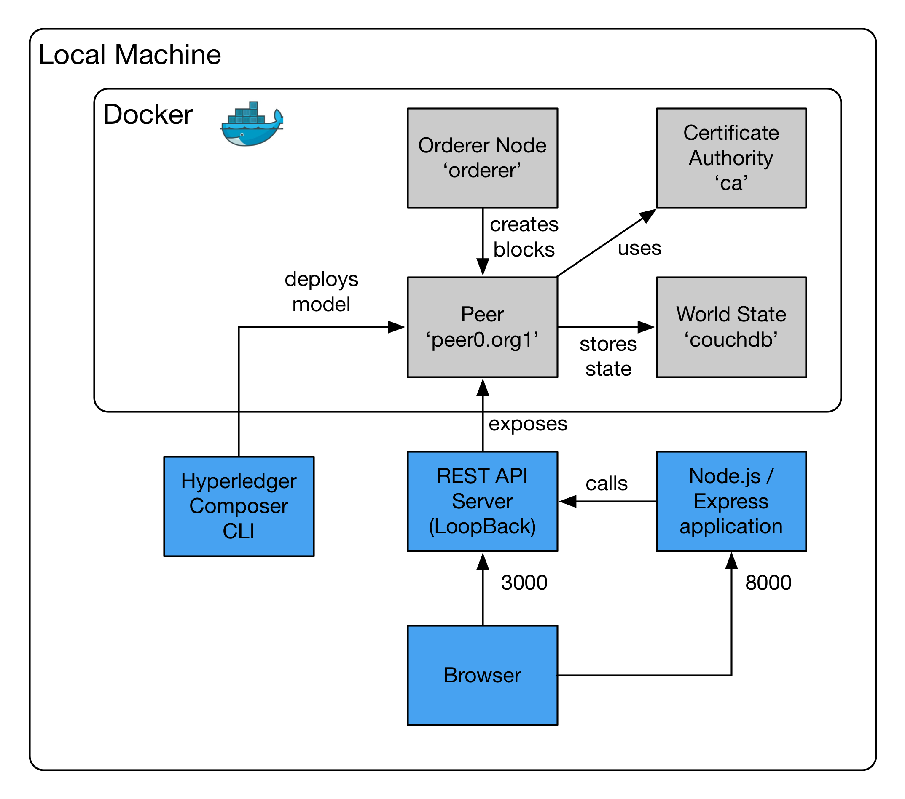

# Blockchain Lab 5 - Set up a Hyperledger prototype environment

The previous lab showed how to create a business network (a model and its associated transactions) using Composer Playground, and then how to expose that using a REST API.

We’re now going to look at how to build a real-world prototype.  In this lab we will use Hyperledger Composer’s command line interface to speed development, rather than Composer Playground.

This lab will show you how to deploy the application on your local machine; the next lab will show you how to customise it.  Lab 7 will show you how to package the app and deploy it, along with your Blockchain and API server, to IBM Bluemix.

Deploying locally is similar to the previous lab.  We provide an example application which is written in JavaScript using the Node.js and Express frameworks.



## Download the application directory
If you haven’t already done so, fetch the example business network and application from GitHub as described in [lab 1](./lab1-v1.md) – you’ll find them in the _lab5_ directory.

Open your editor and examine the contents.
```bash
$ cd ../lab5
$ atom .
```

There are a number of directories in this development folder:
-	_business-network_: the Hyperledger Composer business network files (model, transactions, permissions)
-	_rest-server_: the docker-compose file to deploy the Composer REST server as a container
-	_local-hyperledger_: the docker-compose file to deploy Hyperledger locally
-	_profiles_: Composer connection profiles to attach to Hyperledger fabrics running locally, and on Bluemix
-	_express-app_: a Node.js application which offers a web front-end to the business model
-	_admin_: PHP scripts to load sample data into Hyperledger

## Deploy Hyperledger locally
We need to do several things we've done in previous labs to get Hyperledger up and running locally:
- create a connection profile in _~/.composer-connection-profiles_
- copy the access credentials to _~/.composer-credentials_
- create the Hyperledger Fabric containers
- create a channel and attach the peer to it

To speed this process up, we'll use script files. Navigate to the _local-hyperledger_ directory and run the scripts as follows:
```bash
$ ./createComposerProfile.sh
$ ./startFabric.sh
```
These two scripts will do all of the hard work.

## Deploy the business network
Navigate to the _business-network_ directory and use the Composer command line instructions to build and deploy the network.

First, build the network file.  This instruction creates the _digital-property.bna_ file from the model, transaction and permission files in the local directory.
```bash
$ composer archive create -a digital-property.bna -t dir -n .
```
> **NB:** note the dot at the end of that last command - it means _current directory_.

Next, deploy that network file to the local Blockchain, using the connection profile we set up.  
```bash
$ composer network deploy -a digital-property.bna -p hlfv1 -i PeerAdmin -s anything
```
> **NB:** remember that with the _PeerAdmin_ user you can have any password.

Note that under the covers, this deployment creates a chaincode container; you can see it with `docker ps`.

The deployment may take a few minutes.  You can verify that it has completed with
```bash
$ composer network list -n digital-property -p hlfv1 -i PeerAdmin -s anything
```

These Hyperledger Composer command line instructions do essentially the same thing as Hyperledger Composer Playground which we looked at in lab 3.  Having them as commands makes it easier to set up an automated and repeatable DevOps process.

## Start the REST server
This is the same as lab 4, so we’ll just use the command line option rather than typing in all the responses.  Open a new Terminal, as this is a long-running process.
```bash
$ composer-rest-server -p hlfv1 -n digital-property -i PeerAdmin -s anything -N never
```
As before, you can browse the API explorer at http://localhost:3000/explorer.


## Load the sample data
You can pre-populate your Blockchain with some sample data.  In keeping with ’12-Factor’ guidelines (_XII: Run admin/management tasks as one-off processes_), we have set up a simple Python script to do that.

Navigate to the _admin_ directory and run it
```bash
$ python ./data-setup.py
```
View the sample data using the API explorer.

> **NB:** some installations of Python don't include the _requests_ library which is required by this Python script. If you get errors to that effect, install the Python package manager (pip) then use that to install the requests library:
```bash
$ sudo easy_install pip
$ pip install requests
```

## Start the application
Open a new Terminal and navigate to the _express-app_ directory.  Start the application with
```bash
$ npm install
$ npm start
```

You can browse to the application at http://localhost:8000.  Try adding new users and properties.

## Browse the application files
The example application is written in Node.js and uses the Express web application framework and the Twitter Bootstrap ‘look-and-feel’.  Open the _express-app_ directory in an editor and examine the different files.

- _app.js_ – this is where the application is set up.  Line 17 defines where the application should look for the REST server (remember we have it running locally at the moment).  At line 29 we define the high level routing – for example, if we browse to http://localhost:8000/Person , that request will be sent to the _/routes/Person.js_ module.

- _routes_ directory – the modules in here handle the logic behind the user interface.  Each module function generally handles one URL route.  This usually involved getting some data by calling a _model_ function, and then creating the HTML for the resulting page with the _res.render()_ function.

- _models_ directory – the modules in here handle the data, calling the APIs on the REST server.  There is often some enrichment of data, for example in the _LandTitleModel.js_ module, the owner name is added based on the owner ID.

- _views_ folder – the web pages are stored as templates using the Jade templating system.  These templates are called by the _res.render()_ functions in the _routes_ modules, and are converted in to HTML before being sent back to the web browser.

Continue to [lab 6](./lab6-v1.md) to see how to customise this application for your own business model needs.
