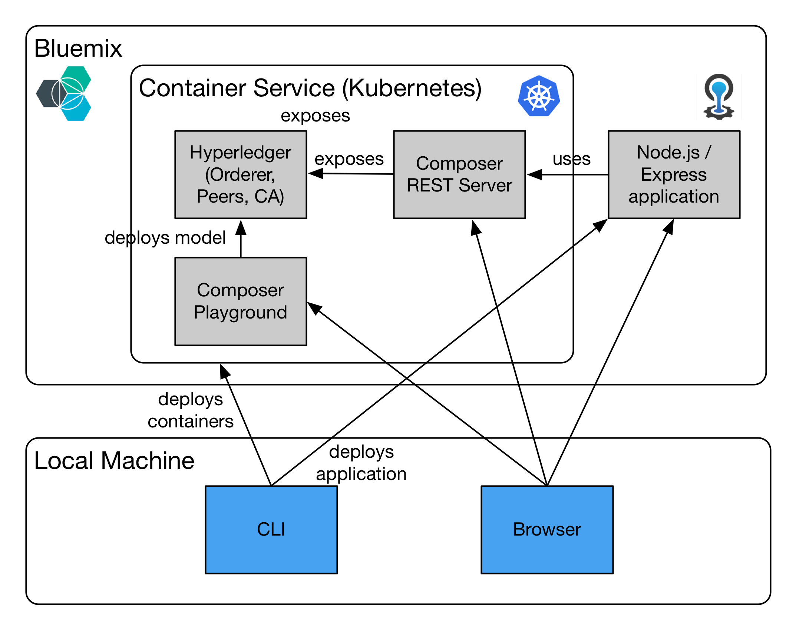
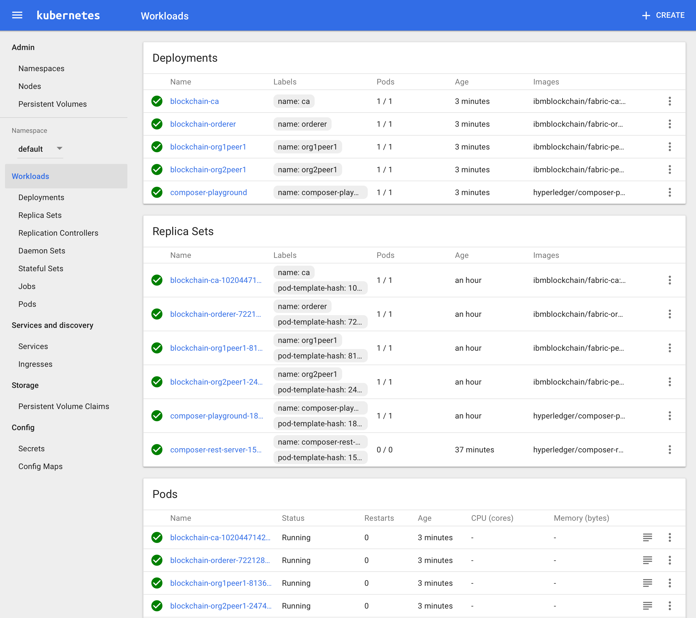

# Blockchain Lab 7 - Deploy Hyperledger on Bluemix

This lab and [lab 8](./lab8-v1.md) will show you how to deploy your Hyperledger-based Blockchain network on the IBM Container Service on Bluemix. Once there, you can investigate other ways to interact with your business network, including OpenWhisk and Node-RED.



> **Learning Point:** The IBM Container Service is a hosted container service on IBM's Bluemix Cloud platform, using open source Docker technology. It uses Kubernetes clusters to orchestrate, schedule and manage those containers.  Detailed education on Kubernetes (you'll also see it written _K8s_) is beyond the scope of this lab, but you can start with this [YouTube video](https://www.youtube.com/watch?v=4ht22ReBjno&feature=youtu.be
).

> For production workloads, you can use the IBM Blockchain Platform, which is a highly available, secure and resilient managed Blockchain service on IBM Cloud. See [here](https://www.ibm.com/blockchain/platform/) for more details.


## Install the pre-requisites
As you'll be interacting with Kubernetes and with IBM Bluemix in this lab, you need to install two further command line tools at the levels shown (or higher):
- kubectl: v1.7 (the Kubernetes command line tool)
- bx: v0.5 (the Bluemix command line tool).

Install `kubectl` from https://kubernetes.io/docs/tasks/tools/install-kubectl/ - use the section titled _Install kubectl binary via curl_. You will need to select your OS and follow some basic instructions to download a file, mark it as executable, and move it into position.

Install `bx` from
https://console.bluemix.net/docs/cli/reference/bluemix_cli/index.html#install_bluemix_cli - use the command shown in the _Online installation_ section.

Validate the installations with `kubectl version` and `bx -v`.

Now add the container service plugin - this will let you interact with the IBM Container Service. Add the repo first (this tells the following command where to find the plugin to be installed) - you may get a message saying it already exists, if so that's fine.

```bash
$ bx plugin repo-add bluemix https://plugins.ng.bluemix.net
$ bx plugin install container-service -r bluemix
```

## Set up a container cluster
Point the Bluemix CLI at the API endpoint for your Bluemix setup, then login
```bash
$ bx api api.ng.bluemix.net
$ bx login
```
This will ask for your userid and the account password.

> **NB:** the API endpoint used is for IBM's US South region. If you want to use another region you will need to replace _ng_ in the API with the code for that region, e.g. _eu-gb_ for the UK.

You will be asked to select an organisation (usually your email address) and a space (call it something like 'blockchain'). If you don't get asked, you can specify them with
```bash
$ bx target -o <org-name> -s <space-name>
```

Now create the cluster on the IBM Container Service
```bash
$ bx cs cluster-create --name blockchain
```

This could take up to 30 minutes. You can check progress with
```bash
$ bx cs clusters
```
Once the _State_ shows _normal_, it's done.  You should see something like this:
```bash
Listing clusters...
OK
Name         ID                                 State    Created                    Workers
blockchain   0783c15e421749a59e2f5b7efdd351d1   normal   2017-05-09T16:13:11+0000   1
```

Once that's done, you can check the status of the worker node:
```bash
$ bx cs workers blockchain
```
This will show the public and private IP addresses.  Note down the public IP address, as you will use this later to access the Blockchain network.

## Configure kubectl to use the cluster
Issue the following command
```bash
$ bx cs cluster-config blockchain
```

The output will contain an `EXPORT` command which will point your local `kubectl` to the cluster.  Copy and paste that command into the command line and run it. It will be something like this:
```bash
$ export KUBECONFIG=/home/*****/.bluemix/plugins/container-service/clusters/blockchain/kube-config-prod-dal10-blockchain.yml
```

## Install the Blockchain network
Go to the _lab7_ directory, and examine the contents of the _kube-configs_ directory in there.  This is like a complex _docker-compose_ file, but spread out over many files. For example, the _blockchain-services.yaml_ file defines four 'services' which will be available - a CA, an orderer and two peers (sounds familiar?), while the _blockchain.yaml_ file specifies the detail of the images to be used to build those services, the startup commands, shared volumes and environment variables.

You might notice that we're using different container images here - e.g. _ibmblockchain/fabric-peer:1.0.0_.  These are the official IBM container images for Hyperledger; they are functionally identical, but IBM will offer support for Blockchain networks built with these, rather than with the ones from Hyperledger themselves.

From the _lab7_ directory:
```bash
$ cd scripts
$ ./create_all.sh --with-couchdb
```
> **NB:** if you don't need CouchDB, i.e. you don't need to use complex queries, you can omit the `--with-couchdb` parameter.

This will instruct Kubernetes to build the container network as defined by our configuration files. It will take a few minutes to do that.

Once it's done you can use the Kubernetes Dashboard to explore the services and pods which have been created.  Run
```bash
$ kubectl proxy
```

Now browse to http://localhost:8001/ui and you will see the dashboard.



This is where your running containers (or 'pods') are displayed. You'll see the usual ones - CA, orderer, peers etc.  You can also see some which have terminated - one of them (utils) is a pod of three containers (_cryptogen_, _configtxgen_ and _bootstrap_), which manage the administration of generating and deploying keys and certificates. This view is somewhat analogous to running `docker ps -a` locally.

In fact, you can get all of this information from the command line (try `kubectl get pods -a`), but it's convenient to have it all just a few clicks away.

Now proceed to [lab8](./lab8-v1.md), where we will show you how to deploy Hyperledger Composer REST Server, and your application on Bluemix as well.
