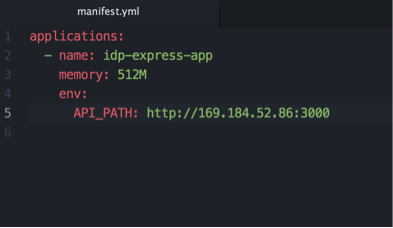

# Blockchain Lab 8 - Deploy Composer Playground and REST server to Bluemix

This lab continues with the deployment of our Blockchain application to IBM Bluemix.  We will now use the Composer Playground and Composer REST Server within the Kubernetes environment, and then deploy our Node.js application to Cloud Foundry on Bluemix.

## Use Composer Playground
You may have noticed that in [lab 7](./lab7-v1.md) we deployed Hyperledger Composer Playground to our IBM Container Service environment. You can see it by browsing the Kubernetes Dashboard or with `kubectl get pods`.

To access it we need to know the IP address and port. The IP address is the Public IP address we noted down earlier - you can find it from `bx cs workers blockchain`. The port is defined in the Kubernetes configuration file _composer-playground-services.yaml_ in the _kube-config_ directory, and by default is 31080.

So to access the Composer Playground, browse to http://your-ip-address:31080

You can use the Playground as before to try out business networks. However, in a typical DevOps environment you would maintain the business network model source files and use them to build a _*.bna_ file, as we did in [lab 5](./lab5-v1.md) with
```bash
$ composer archive create -a <network-name>.bna -t dir -n .
```
Then import that _*.bna_ file into Composer Playground and deploy it from there.


## Deploy the REST server
When the Composer REST server starts, it reads the model information from the business network which is deployed in the Blockchain.  Therefore you can't start it until _after_ you have deployed the business network.

That's the reason we didn't deploy the REST server along with all the other services; we're going to do that now.

We're still using the _lab7_ directory.
```bash
$ kubectl create -f kube-configs/composer-rest-server-services.yaml
$ kubectl create -f kube-configs/composer-rest-server.yaml
```

> **Learning Point:** the _create-all.sh_ script we ran in the previous lab executed lots of `kubectl create` commands like this one, to start the other services and pods we needed.

Examine the running pods (either with the Kubernetes Dashboard or `kubectl get pods`) to see that the REST server has started.

The port number on which the server is running is defined in _composer-rest-server-services.yaml_ and is 31090 by default.

So to access the Composer REST server explorer, browse to http://your-ip-address:31090/explorer


## Deploy the application to Cloud Foundry on Bluemix
Now that the REST server is deployed with a public IP address, we can access the Blockchain from anywhere.  We will now deploy our Node.js Express application from [lab 5](./lab5-v1.md) to Bluemix as a Cloud Foundry app.

> **NB:** you can work with the Express app in the _lab5_ directory, or copy it to a directory under _lab7_.  You'll also need to copy the _admin_ directory if you want sample data.

It’s simple to deploy a well-structured application to Cloud Foundry, the only additional thing you need is a _manifest.yml_ file.  Navigate to the _express-app_ directory and look at that file.



> **Learning Point:** Cloud Foundry is just a specialised container which runs an application deployment tool called Diego.  It will recognise this package as a Node.js application, and will use the information in the manifest to manage the deployment of the code for us.

You need to make a couple of changes in here:
-	edit the application name – this must be unique
-	edit the _API-PATH_ environment variable to the IP address and port of your REST server

You will also need to set the _apiPath_ variable in the _admin/data.setup.py_ Python script if you want the sample data.

Once that is done, you’re all set to deploy.

Using the Cloud Foundry CLI, login to Cloud Foundry (again, you’ll need a one-time code from the location shown)
```bash
$ cf login
```

Now, simply push the application to Cloud Foundry
```bash
$ cf push
```

Wait a few moments, and your application will be deployed to Bluemix.  You should be able to access it at http://xxx-express-app.mybluemix.net or similar, depending on your application name in the manifest.

## Cleaning up
Leave your Blockchain network, REST server and app running as you'll need them for the next couple of labs.  However, when you need to clean up, you can remove the containers you deployed via Kubernetes with a single script. From the _lab7_ directory:
```bash
$ cd scripts
$ ./delete_all.sh
```
To remove the app you deployed to Cloud Foundry in Bluemix (replace with your specific app name):
```bash
$ cf delete xxx-express-app
```

**Congratulations!**  You’ve created a Hyperledger Blockchain with a business network model and deployed that, together with a REST server, to a Kubernetes-managed container environment - and deployed your application, all on Bluemix.

In [lab 9](./lab9-v1.md) we'll show you how to access your Blockchain model from OpenWhisk.
