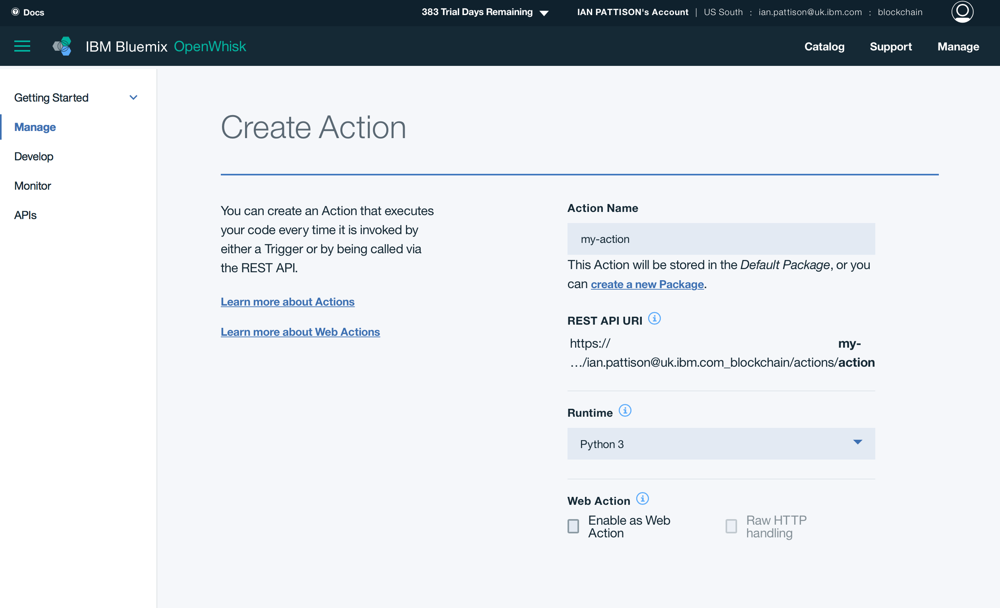

# Blockchain Lab 9 - Access Hyperledger from OpenWhisk

Now that your business network is available via an API on Bluemix, you can access it in many different ways.

OpenWhisk is an open standard mechanism for ‘serverless’ computing, also known as ‘Function-as-a-Service’ or FaaS.  It allows you to execute snippets of code, without the overhead of a continually running server or application.  If you’re familiar with AWS Lambda this is similar, but Lambda is proprietary.

## Create an OpenWhisk Action
Log into your Bluemix account.  In the left-hand menu, select  _OpenWhisk_.   Click _Start Creating_ then _Create Action_.  Enter a name for your action (e.g. _my-action_) and select _Python 3_ as the Runtime, then click _Create_.



Click _Edit Action Code_, then paste the following into the code editor.  See if you can figure out what the code is doing.  You will need to set the API path to match your own REST server.
```python
import sys
import json
import random
import requests

def main(dict):
    apiPath = 'http://169.46.24.81:3000'

    id = 'ID:' + str(random.randint(1000,9999))
    fname = random.choice(['Alice', 'Bob', 'Chris', 'Daniel', 'Eli'])
    lname = random.choice(['Ashton', 'Bestwick', 'Carluccio', 'Davies', 'Edwards'])
    person = {'personId': id, 'firstName': fname, 'lastName': lname}

    headers = {'Content-Type': 'application/json'}
    r = requests.post(apiPath + '/api/Person', json.dumps(person), headers=headers)

    return {'person': person}
```

Click _Run this Action_, then click _Make it Live_ and _Run with this Value_ (you don’t need to specify any arguments).  You should see a new person appear in your Blockchain.

## Create an OpenWhisk Trigger
If you haven't already, download and install the OpenWhisk CLI from [here](https://console.bluemix.net/openwhisk/learn/cli?env_id=ibm:yp:us-south).

Run the `wsk property set` command which is shown on that page.
> **NB:** this sets the authentication key, and is unique to your org and namespace.

Create an OpenWhisk trigger event - for example, we're going to create a timer event called _my-trigger_ which fires every two minutes.
```bash
$ wsk trigger create my-trigger --feed /whisk.system/alarms/alarm --param cron "*/2 * * * *"
```

You can now link the trigger to the action we created earlier with a _rule_.
```bash
$ wsk rule create my-rule my-trigger my-action
```

You should now see a new random person added to your Blockchain every two minutes.  To cancel, disable the rule and delete the trigger.
```bash
$ wsk rule disable my-rule
$ wsk trigger delete my-trigger
```

For more information on the types of triggers and actions you can create with OpenWhisk, see [here](https://console.bluemix.net/docs/openwhisk/index.html#getting-started-with-openwhisk).

In [lab 10](./lab10-v1.md) we will see how to respond to business model events with Node-RED.
